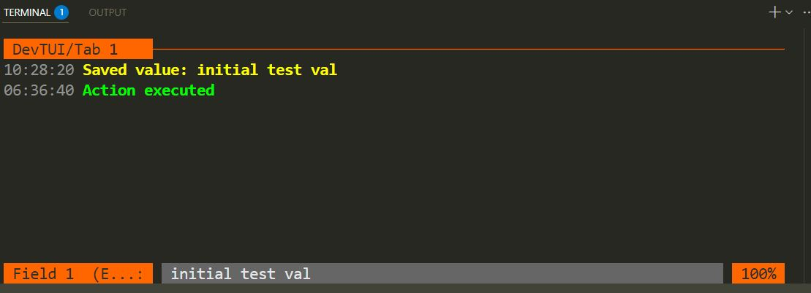

# DevTUI
<!-- START_SECTION:BADGES_SECTION -->
<a href="docs/img/badges.svg"></a>
<!-- END_SECTION:BADGES_SECTION -->

Reusable **message presentation system** for Go development tools. DevTUI is a pure display layer built on bubbletea that formats and organizes messages from your business logic handlers. 

**What DevTUI does**: Takes messages from your handlers via `progress()` callbacks and displays them in a clean, organized terminal interface with tabs, navigation, and automatic formatting.

**What DevTUI doesn't do**: Validate data, handle errors, or manage business logic. Your handlers are responsible for their own state and decisions - DevTUI just shows whatever they tell it to show.



**[→ Why DevTUI?](docs/DESCRIPTION.md)** - Complete purpose and functionality description

## Quick Start


DevTUI uses specialized handler interfaces that require minimal implementation. Here is a complete example using the new simplified API:

```go
// HandlerExecution with MessageTracker - Action buttons with progress tracking
type BackupHandler struct {
    lastOpID string
}

func (h *BackupHandler) Name() string  { return "SystemBackup" }
func (h *BackupHandler) Label() string { return "Create System Backup" }
func (h *BackupHandler) Execute(progress func(string)) {
    progress("Preparing backup...")
    time.Sleep(200 * time.Millisecond)
    progress("Backing up database...")
    time.Sleep(500 * time.Millisecond)
    progress("Backup completed successfully")
}

// MessageTracker implementation for operation tracking
func (h *BackupHandler) GetLastOperationID() string   { return h.lastOpID }
func (h *BackupHandler) SetLastOperationID(id string) { h.lastOpID = id }

func main() {
    tui := devtui.NewTUI(&devtui.TuiConfig{
        AppName:  "Demo",
        ExitChan: make(chan bool),
        Color: &devtui.ColorStyle{
            Foreground: "#F4F4F4",
            Background: "#000000",
            Highlight:  "#FF6600",
            Lowlight:   "#666666",
        },
        LogToFile: func(messages ...any) {
            // Replace with actual logging implementation
        },
    })

    // Operations tab with ExecutionHandlers (action buttons)
    ops := tui.NewTabSection("Operations", "System Operations")
    ops.AddExecutionHandlerTracking(&BackupHandler{}, 5*time.Second)

    var wg sync.WaitGroup
    wg.Add(1)
    go tui.Start(&wg)
    wg.Wait()
}
```

👉 **[See complete example with all handler types](example/demo/main.go)**

## Handler Interfaces

DevTUI provides 5 specialized handler types, each requiring minimal implementation:

### 1. HandlerDisplay - Read-only Information (2 methods)
```go
type HandlerDisplay interface {
    Name() string    // Full text to display in footer
    Content() string // Content shown immediately
}
```

### 2. HandlerEdit - Interactive Input Fields (4 methods)  
```go
    Name() string    // Unique identifier for logging
    Label() string   // Field label
    Value() string   // Current/initial value
    Change(newValue string, progress func(string))
}
```

### 3. HandlerExecution - Action Buttons (3 methods)
```go
    Name() string  // Unique identifier for logging
    Label() string // Button label
    Execute(progress func(string))
}
```

### 4. HandlerWriter - Simple Logging (1 method)
```go
type HandlerWriter interface {
    Name() string // Writer identifier
}
```

### 5. HandlerWriterTracker - Advanced Logging (3 methods)
```go
type HandlerWriterTracker interface {
    Name() string
    MessageTracker
}

type MessageTracker interface {
    GetLastOperationID() string
    SetLastOperationID(id string)
}
```

tab.AddEditHandler(handler).WithTimeout(5*time.Second)
tab.AddExecutionHandler(handler).WithTimeout(10*time.Second)
tab.AddEditHandlerTracking(handlerWithTracker).WithTimeout(5*time.Second)
tab.AddExecutionHandlerTracking(handlerWithTracker).WithTimeout(10*time.Second)
type LogWriter struct{}

## Registration Methods (New Simplified API)

```go
// Display handlers (no timeout needed)
tab.AddDisplayHandler(handler)

// Edit handlers (timeout mandatory)
tab.AddEditHandler(handler, 5*time.Second)
tab.AddEditHandlerTracking(handlerWithTracker, 5*time.Second)

// Execution handlers (timeout mandatory)
tab.AddExecutionHandler(handler, 10*time.Second)
tab.AddExecutionHandlerTracking(handlerWithTracker, 10*time.Second)

// Writers (returns io.Writer)
type LogWriter struct{}
func (w *LogWriter) Name() string { return "LogWriter" }

writer := tab.RegisterWriterHandler(&LogWriter{}) // io.Writer
writer.Write([]byte("Log message 1"))
writer.Write([]byte("Another log entry"))
```

## Key Features

- **Minimal Implementation**: 1-4 methods per handler
- **Specialized Interfaces**: Clear separation by purpose (Display, Edit, Execution, Writing)
- **Progress Callbacks**: Real-time feedback for long-running operations
- **Message Tracking**: Update existing messages instead of creating new ones
- **Method Chaining**: All handler registration methods return `*tabSection` for chaining
- **Thread-Safe**: Concurrent handler registration and execution

## Navigation
- **Tab/Shift+Tab**: Switch between tabs
- **Left/Right**: Navigate fields within tab  
- **Up/Down**: Scroll viewport line by line
- **Page Up/Page Down**: Scroll viewport page by page
- **Mouse Wheel**: Scroll viewport (when available)
- **Enter**: Edit/Execute
- **Esc**: Cancel edit
- **Ctrl+C**: Exit


**Note**: DevTUI automatically loads a built-in [ShortcutsHandler](shortcuts.go) at position 0 in the first tab, which displays detailed keyboard navigation commands. This handler demonstrates the `HandlerEdit` interface and provides interactive help within the application.

**Text Selection**: Terminal text selection is enabled for copying error messages and logs. Mouse scroll functionality may vary depending on bubbletea version and terminal capabilities.


## Documentation

- **[Complete API Specification](docs/API_ANYHANDLER_FINAL.md)** - Final API design and interfaces


## Acknowledgments

DevTUI is built on top of the excellent libraries from [github.com/charmbracelet](https://github.com/charmbracelet): bubbletea, bubbles and lipgloss, which provide the solid foundation for creating terminal interfaces in Go.


## [Contributing](docs/CONTRIBUTING.md)